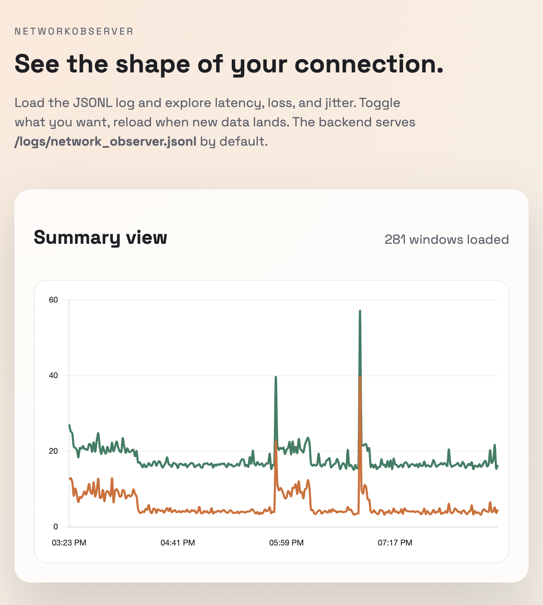

# NetworkObserver

NetworkObserver is a highly configurable, LAN network observability stack that measures latency, loss, jitter, and throughput, aggregating data in configurable buckets and surfacing it through JSONL logs and a UI.



## What it does
- Active probes to configured targets (gateway + public) every interval
- Per‑window stats (loss, RTT percentiles, jitter, spike count)
- Optional throughput testing via iperf3
- JSONL output for easy parsing
- Web UI served by the backend for LAN access

## Architecture
- Kotlin backend (single process)
- Frontend built with Vite + React + Chart.js
- Built‑in HTTP server serves UI and logs

## Quick start (local)
```bash
./scripts/start.sh
```
Then open:
```
http://<lan-ip>:8080
```

## Quick start (Docker)
```bash
docker compose up --build
```
Then open:
```
http://<lan-ip>:8080
```

Notes:
- `config.json` is mounted into the container
- Logs are written to `backend/logs/`

## Configuration
Edit `config.json` to control targets, thresholds, and throughput settings.

Key fields:
- `targets.gateway`, `targets.public`
- `probe_interval_seconds`, `window_seconds`
- `thresholds.*`
- `throughput.*` (requires iperf3)

## Logs
- Metrics: `backend/logs/network_observer.jsonl`
- App logs: `backend/logs/network_observer_app.log`

## Troubleshooting
- If throughput tests fail inside Docker, make sure the server is reachable and try a port range.
- If the UI is not reachable on mobile, make sure you are using the LAN IP of the host and port 8080.

## Development
Backend:
```bash
cd backend && gradle run --args="--config ../config.json"
```

Frontend (dev server):
```bash
cd frontend && npm install && npm run dev -- --host 0.0.0.0
```

## Status
This project is under active development and is a vibe-coded application. See `DESCRIPTION.md` for schema and design details.
